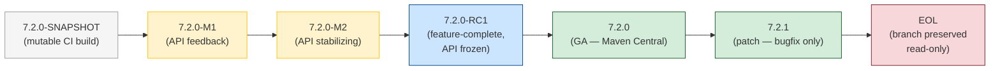
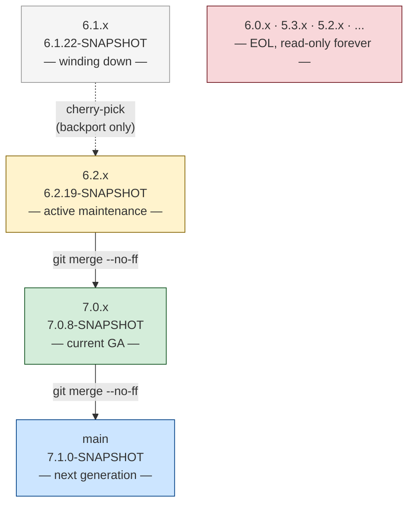
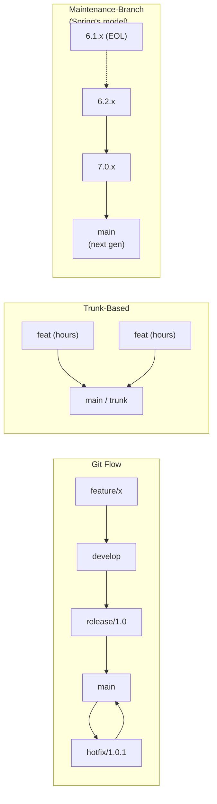
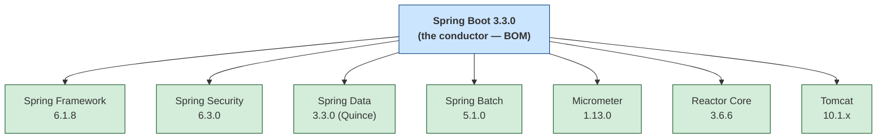
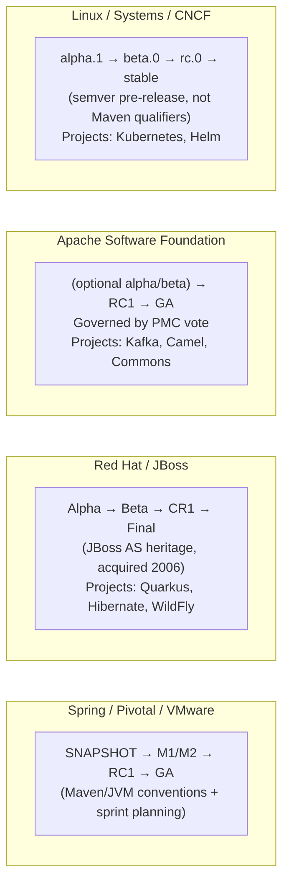
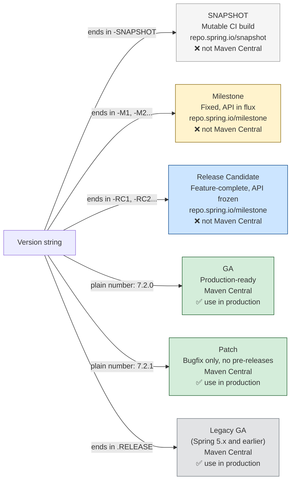

# OSS Release Strategy — Diagrams

Mermaid diagrams for use in the team presentation and reference doc.
Renders in GitHub, VS Code (with Mermaid extension), Obsidian, and any Marp viewer.

---

## Diagram 1 — Release Lifecycle Timeline

From first commit to end-of-life for a Spring minor version.



**Key:** Gray = mutable/unstable · Yellow = pre-release (milestone repo only) · Blue = API frozen · Green = production (Maven Central) · Red = no further patches

---

## Diagram 2 — Spring Branch Model (April 2026)

How active branches relate and how fixes propagate forward.

```mermaid
gitGraph LR:
   branch "6.1.x"
   checkout "6.1.x"
   commit id: "6.1.22-SNAPSHOT (winding down)"

   branch "6.2.x"
   checkout "6.2.x"
   commit id: "6.2.19-SNAPSHOT"
   commit id: "Fix: resource loader"

   branch "7.0.x"
   checkout "7.0.x"
   commit id: "7.0.8-SNAPSHOT"
   merge "6.2.x" id: "Merge 6.2.x → 7.0.x"

   branch "main"
   checkout "main"
   commit id: "7.1.0-SNAPSHOT"
   merge "7.0.x" id: "Merge 7.0.x → main"
```

> **Reading this diagram:** Fixes commit on `6.2.x`, merge forward into `7.0.x`, then merge into `main`. The same fix appears in all three branches. `main` is NOT current stable — it is the next unreleased generation.

---

## Diagram 2b — Branch Stack (simpler view)



---

## Diagram 3 — Three Branching Models Compared



---

## Diagram 4 — Spring Boot Release Train / BOM

How Spring Boot coordinates the Spring ecosystem.



> "We're on Spring Boot 3.3" means all of the above, coordinated.

---

## Diagram 5 — Ecosystem Vocabulary Heritage

Why different projects use different terminology.



---

## Quick Reference — Version String Decoder


