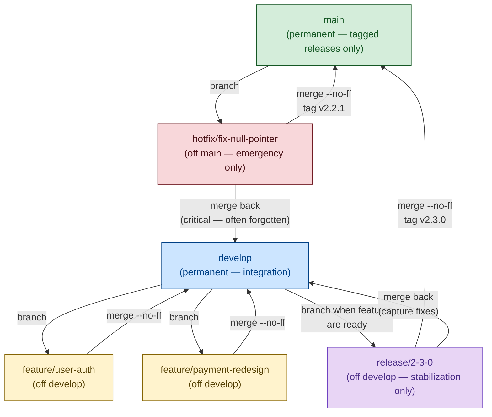
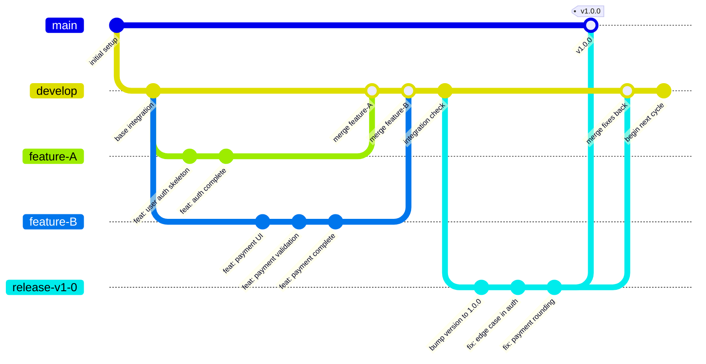
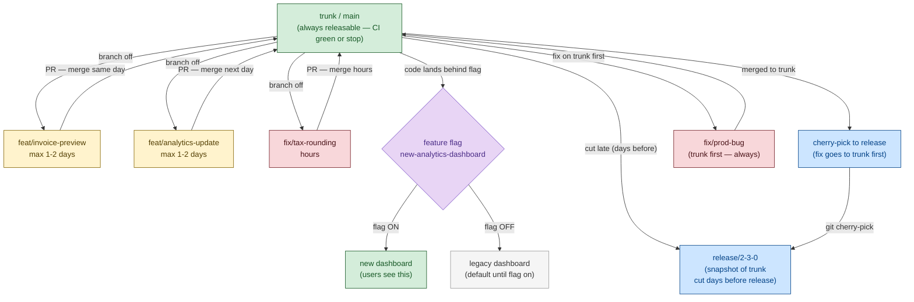
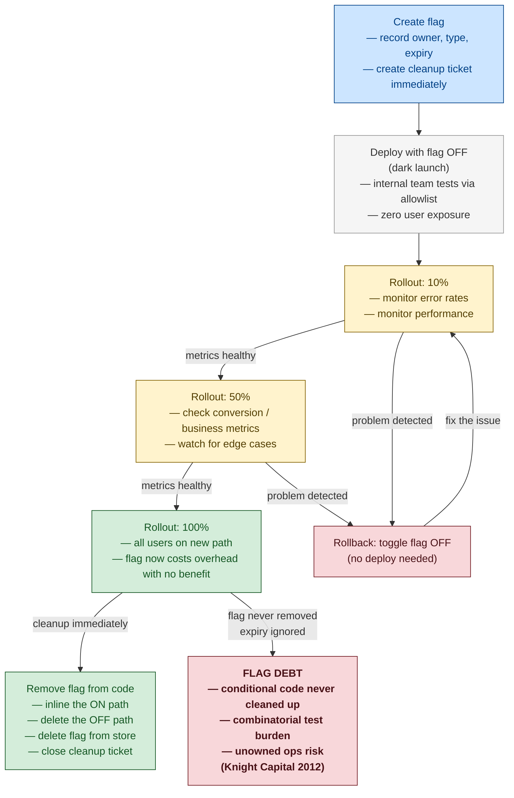
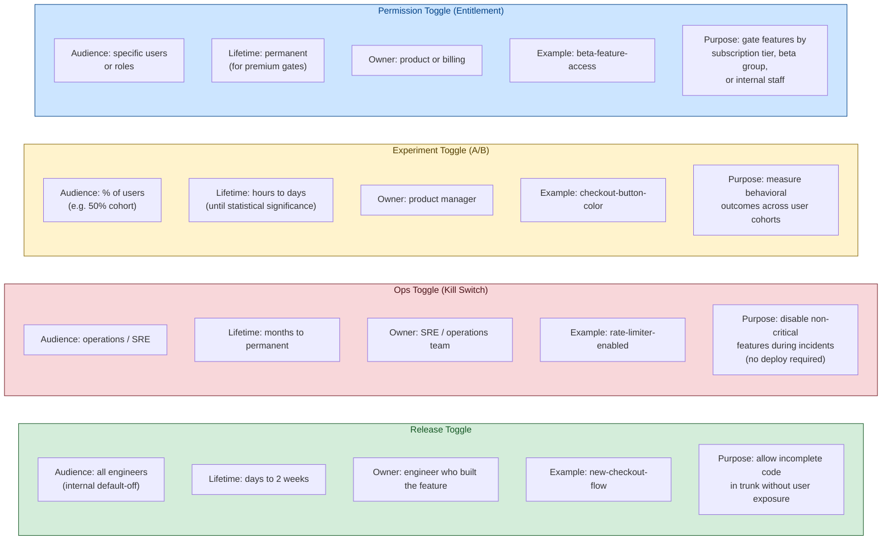
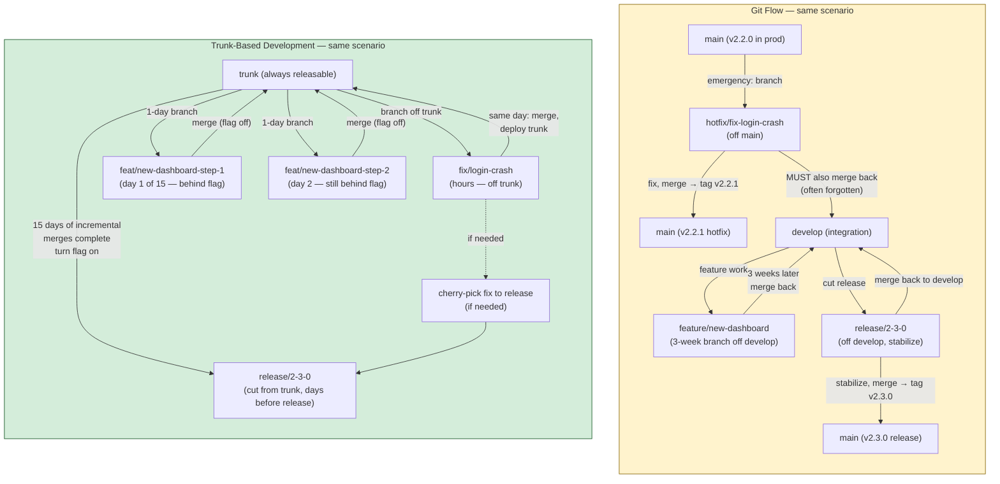
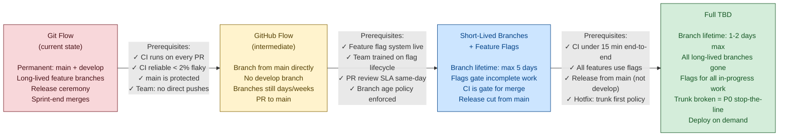

# Enterprise Release Branching — Diagrams

Mermaid diagrams covering Git Flow, Trunk-Based Development, feature flag lifecycles, and the migration path between models.
Renders in GitHub, VS Code (with Mermaid extension), Obsidian, and any Marp viewer.

---

## Diagram 1 — Git Flow Branch Structure

The five branch types and their merge relationships. Main and develop are permanent; feature, release, and hotfix branches are temporary.

**Key:** Green = main (always production-deployable) · Blue = develop (integration stable) · Yellow = feature branches (developer stable, weeks to months) · Purple = release branch (stabilization gate) · Red = hotfix (surgical, immediate)

The two most critical merge rules: the release branch must merge back to develop (to capture stabilization fixes), and the hotfix branch must merge back to develop (to prevent regression). Both are manual steps and are the most commonly forgotten operations in Git Flow.

---

## Diagram 2 — Git Flow Release Process

The full lifecycle from feature development through a tagged release.

> **Reading this diagram:** Feature branches live off `develop` and merge back when complete. The release branch is cut from `develop` when all intended features are in — no new features land after the cut. Bug fixes on the release branch merge to `main` (tagged) and back to `develop`. The `develop` branch continues for the next cycle immediately after the release cut.

---

## Diagram 3 — Trunk-Based Development Flow

Trunk is always releasable. Short-lived branches are code-review artifacts, not isolation units.

**Key structural differences from Git Flow:** There is no `develop` branch — trunk IS the integration surface. Release branches are unidirectional (trunk pushes to release via cherry-pick; the release branch never merges back). Branch lifetime is a hard constraint, not a suggestion.

---

## Diagram 4 — Feature Flag Lifecycle

From creation through controlled rollout to mandatory cleanup.

**The non-negotiable rule:** A release toggle at 100% rollout must be removed immediately. It is no longer protecting anything — it is accumulating maintenance overhead and combinatorial test burden. Knight Capital Group's $460M trading loss (2012) was partly attributed to an unremoved flag that silently reactivated legacy code.

---

## Diagram 5 — Feature Flag Types (Fowler's Taxonomy)

Four flag types with distinct ownership, lifetime, and use cases.

**Critical ownership boundary:** Product managers can control experiment and permission toggles. They must not control release toggles without engineering review — release toggles gate incomplete code, and enabling them prematurely can expose broken paths to users.

---

## Diagram 6 — Git Flow vs Trunk-Based Development: Same Scenario

How each model handles a concurrent bug fix and new feature.

**Observed differences in this scenario:**

| | Git Flow | Trunk-Based |
|---|---|---|
| Hotfix isolation | Separate branch off main | Same trunk, branch for hours |
| Feature isolation | 3-week branch | 15 daily commits, each behind a flag |
| Risk of forgotten merge | Two mandatory merge-backs | None — unidirectional cherry-pick |
| Developer productivity during release stabilization | Team may informally freeze develop | Full speed continues on trunk |
| Rollback mechanism | Revert + redeploy | Toggle flag off instantly |

---

## Diagram 7 — Migration Path: Git Flow to Trunk-Based Development

A phased migration with prerequisites at each stage.

**Phase timeline (realistic for a 10-20 person team):**

| Phase | Duration | Primary goal | Biggest risk |
|---|---|---|---|
| Phase 0: Fix CI | Weeks 1-4 | Reliable, fast CI pipeline | Discovering CI is worse than expected |
| Phase 1: Git Flow → GitHub Flow | Weeks 4-12 | Eliminate develop branch | Long-lived branches completing mid-migration |
| Phase 2: Introduce feature flags | Weeks 6-12 | Team learns flag lifecycle | PM enabling release flags prematurely |
| Phase 3: Shorten branches | Weeks 12-20 | Enforce 5-day then 2-day policy | Deadline pressure creating "stabilization branches" |
| Phase 4: Full TBD | Months 4-6 | Trunk = always releasable | Broken trunk tolerance eroding the invariant |

**Do not skip Phase 0.** Teams that attempt TBD on a slow or flaky CI produce an unstable trunk, lose confidence in the process, and revert. Fixing CI first is the single highest-leverage investment in the migration.
